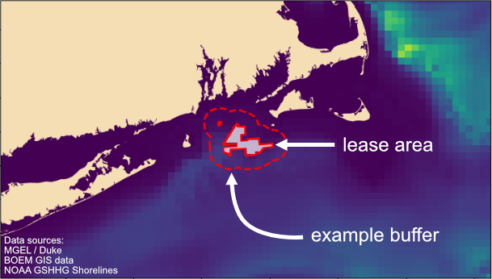

# Overview

<figure>
    
    <figcaption>The background map shows predicted animal density for fin whales in July (MGEL/Duke), yellow shows higher densities, blue shows lower. The Revolution Wind lease area is outlined with a solid red line as an example (BOEM GIS data). The coastline dataset is from NOAA (GSHHG). For demo purposes, an example 10-kilometer buffer is shown.</figcaption>
</figure>

Offshore wind is becoming increasingly important as we explore environmentally responsible energy sources. However, the installation of wind turbines produces noise which can impact marine animals - they may experience behavioral disturbance, injury, and - in extreme cases - even death. To reduce the risk to marine life, studies are conducted to understand where different animals are at different times and how many individuals are likely to be present. Precautions can then be taken to minimize the likelihood of causing harm.

## The Data

For this demo, we're using animal density predictions from the Marine Geospatial Ecology Laboratory (MGEL) at Duke University along with GIS data from the Bureau of Ocean Energy Management. We are essentially trying to understand which species might be near offshore wind lease areas at different times of year - the same data that help regulators and wind operators plan construction schedules.

## Buffers

Different buffer sizes are used to represent a area of impact, where animals may hear the sound and have some sort of response or reaction. The particular buffer sizes used in this demo are arbitrary and are not based on any specific modeling - the distance over which sound can have an effect depends on a LOT of different variables which we won't go into here. 

You can think of the buffers as "cookie cutters" - you overlay the buffer on the density data, and take an average of all the values within that buffer area. Larger or smaller buffer areas will naturally result in different density averages.

## What do these datasets tell us?

The density data tell us how different species are distributed in a given area. For this demo, we are focused on density data off the east coast of the US.

There are separate predictions for each month since the predicted densities are based on environmental parameters, some of which vary monthly.

The predicted area where animals may be impacted can change depending on the type of foundation being installed, and the method of installation. This has implications for the number of animals that might be affected.  

